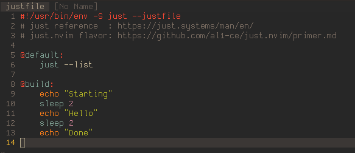
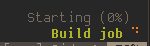
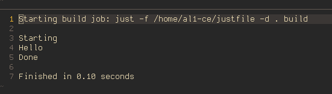
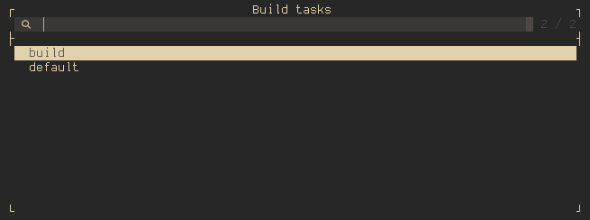

# just.nvim
[Just](https://github.com/casey/just) task runner for neovim

## Screenshots
Example just file (default JustCreateTemplate with added build task)



Fidget hint



Output of `:JustBuild`



`:JustSelect`



## Installation
Using [lazy](https://github.com/folke/lazy.nvim)
```lua
{
    "al1-ce/just.nvim",
    dependencies = {
        'nvim-lua/plenary.nvim',
        'nvim-telescope/telescope.nvim',
        'rcarriga/nvim-notify',
        'j-hui/fidget.nvim',
    },
    config = true
}
```

## Configuration
Default config is:
```lua
require("just").setup({
    fidget_message_limit = 32, -- limit for length of fidget progress message 
    play_sound = false, -- plays sound when task is finished or failed
    open_qf_on_error = true, -- opens quickfix when task fails
    telescope_borders = { -- borders for telescope window
        prompt = { "─", "│", " ", "│", "┌", "┐", "│", "│" }, 
        results = { "─", "│", "─", "│", "├", "┤", "┘", "└" },
        preview = { "─", "│", "─", "│", "┌", "┐", "┘", "└" }
    }
})
```

### Usage
You can configure your build tasks with justfile located in your Current Directory. These tasks are local and will be displayed only for this local project.

Any output coming from executing tasks will be directed into *quickfix* and *fidget* and upon completing/failing task the bell will play using `lua/just/build_success.wav` or `lua/just/build_error.wav` accordingly. This can be changed in `lua/just/init.lua` or same file in typescript (preferred, but requires executing TypescriptToLua and executing `tstl -p tsconfig.json`)

Commands:
- `JustDefault` - Builds current file/project using `default` task.
- `JustBuild` - Builds current file/project using `build` task.
- `JustRun` - Builds current file/project using `run` task.
- `JustTest` - Builds current file/project using `test` task.
- `JustSelect` - Gives you selection of all tasks in `justfile`.
- `JustStop` - Stops currently executed task
- `JustCreateTemplate` - Creates template `justfile` with included "cheatsheet".
- `JustMakeTemplate` - Creates make-like template `justfile` to allow compiling only changed files.

Only one task can be executed at same time.

## [More info](htts://github.com/al1-ce/just.nvim/blob/master/primer.md)
Click the link

